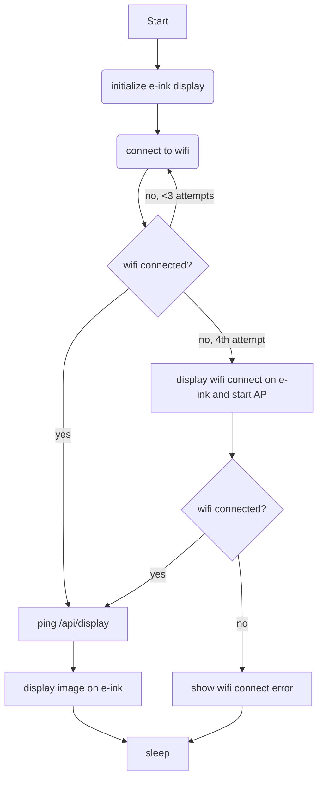

# DearDisplay Firmware

```mermaid
graph TD;
    A[Start] --> B(initialize e-ink display);
    B --> C(connect to wifi);
    C --> D{wifi connected?}

    D -- "no, <3 attempts" --> C
    D -- "no, 4th attempt" --> E[display wifi connect on e-ink and start AP]
    D -- yes --> F[ping /api/display]

    F --> G[display image on e-ink]
    G --> H[sleep]

    E --> I{wifi connected?}
    I -- yes --> F
    I -- no --> J[show wifi connect error]
    J --> H
```
